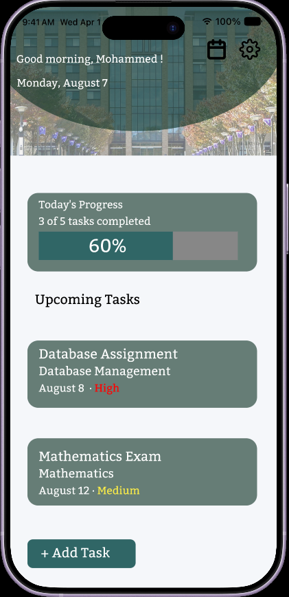
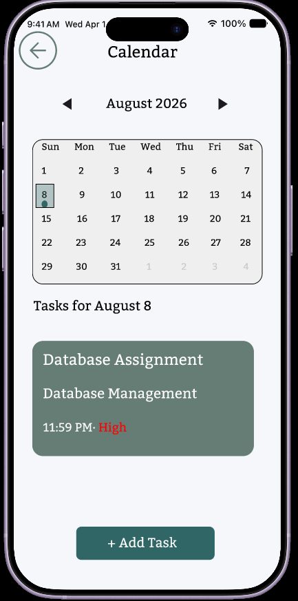
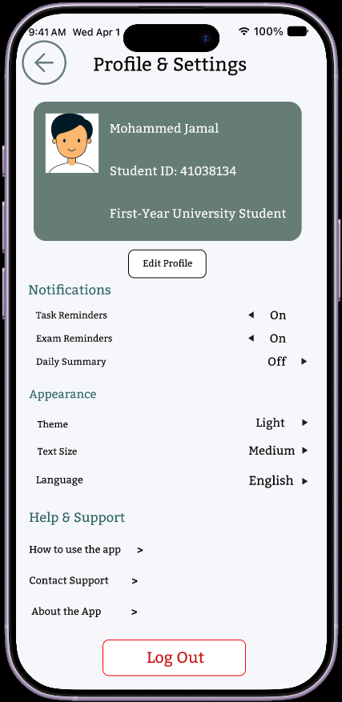

# University Student Task Manager

A mobile UI/UX case study designed in Figma to help university students organize assignments, exams, deadlines, priorities, and reminders.

## Project Overview

The project focuses on creating a simple mobile experience that allows students to:

- View upcoming academic tasks
- Track daily progress
- Add assignments, exams, and projects
- Set deadlines, priorities, and reminders
- View tasks through a calendar
- Manage profile and notification settings

## Screens

### Home

### Add Task

### Task Details

### Calendar

### Profile & Settings

## Design Process

- Defined the user problem and project goal
- Created the user flow and screen structure
- Designed five mobile screens
- Built an interactive navigation prototype
- Improved visual hierarchy, consistency, and action clarity through multiple iterations

## Tools

- Figma
- User Flows
- UI Design
- Interactive Prototyping

## Case Study

[View the complete PDF case study](University%20Student%20app%20Preview.pdf)

## Interactive Prototype

[View the Figma prototype] ( https://www.figma.com/proto/7tpMQppM5r6w7TdkQ52ErF/University-Student-app?node-id=0-1&t=AjDwJMoxG3bsaEum-1 )

## Designer

**Ahmad Karmoul**

Junior UI/UX Designer with a background in Unity, XR, and interactive application development.
